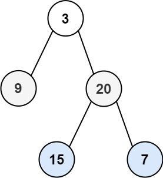

给你二叉树的根节点 root ，返回其节点值的 锯齿形层序遍历 。（即先从左往右，再从右往左进行下一层遍历，以此类推，层与层之间交替进行）。

--- 

示例 1：


输入：root = [3,9,20,null,null,15,7]
输出：[[3],[20,9],[15,7]]

---

示例 2：

输入：root = [1]
输出：[[1]]

---

示例 3：

输入：root = []
输出：[]
 

提示：

树中节点数目在范围 [0, 2000] 内
-100 <= Node.val <= 100

```
/**
 * Definition for a binary tree node.
 * struct TreeNode {
 *     int val;
 *     TreeNode *left;
 *     TreeNode *right;
 *     TreeNode() : val(0), left(nullptr), right(nullptr) {}
 *     TreeNode(int x) : val(x), left(nullptr), right(nullptr) {}
 *     TreeNode(int x, TreeNode *left, TreeNode *right) : val(x), left(left), right(right) {}
 * };
 */
class Solution {
public:
    vector<vector<int>> zigzagLevelOrder(TreeNode* root) {
        vector<vector<int>> res;
        queue<TreeNode*> q;

        if (!root) return {};
        q.push(root);

        int flag = 0;
        while (q.size())
        {
            int len = q.size();
            vector<int> level;

            while (len --)
            {
                auto t = q.front();
                q.pop();

                level.push_back(t->val);
                if (t->left) q.push(t->left);
                if (t->right) q.push(t->right);
            }
            
            if (flag) reverse(level.begin(), level.end());
            res.push_back(level);
            flag = flag ^ 1;
        }

        return res;
    }
};
```