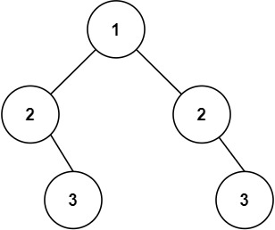

给你一个二叉树的根节点 root ， 检查它是否轴对称。

---

示例 1：


输入：root = [1,2,2,3,4,4,3]
输出：true

---

示例 2：


输入：root = [1,2,2,null,3,null,3]
输出：false
 

---

提示：

树中节点数目在范围 [1, 1000] 内
-100 <= Node.val <= 100
 

进阶：你可以运用递归和迭代两种方法解决这个问题吗？

```
/**
 * Definition for a binary tree node.
 * struct TreeNode {
 *     int val;
 *     TreeNode *left;
 *     TreeNode *right;
 *     TreeNode() : val(0), left(nullptr), right(nullptr) {}
 *     TreeNode(int x) : val(x), left(nullptr), right(nullptr) {}
 *     TreeNode(int x, TreeNode *left, TreeNode *right) : val(x), left(left), right(right) {}
 * };
 */
class Solution {
public:
    bool isSymmetric(TreeNode* root) {
        if (!root) return true;
        return dfs(root->left, root->right);
    }

    bool dfs(TreeNode* p, TreeNode* q)
    {
        if (!p && !q) return true; // 左右都没有子树
        if (!p || !q || p->val != q->val) return false; // 左右只有一边有子树一边没有子树，或者都有子树两个子树根不相同
        return dfs(p->left, q->right) && dfs(p->right, q->left);// 左子树的左边与右子树的右边相同，并且右子树的右边与左子树的左边相同。
    }
};
```