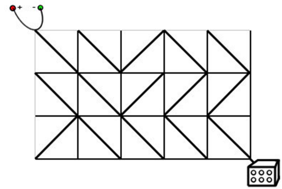
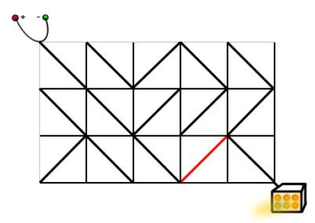

达达是来自异世界的魔女，她在漫无目的地四处漂流的时候，遇到了善良的少女翰翰，从而被收留在地球上。

翰翰的家里有一辆飞行车。

有一天飞行车的电路板突然出现了故障，导致无法启动。

电路板的整体结构是一个 R 行 C
 列的网格（R,C≤500），如下图所示。



每个格点都是电线的接点，每个格子都包含一个电子元件。

电子元件的主要部分是一个可旋转的、连接一条对角线上的两个接点的短电缆。

在旋转之后，它就可以连接另一条对角线的两个接点。

电路板左上角的接点接入直流电源，右下角的接点接入飞行车的发动装置。

达达发现因为某些元件的方向不小心发生了改变，电路板可能处于断路的状态。

她准备通过计算，旋转最少数量的元件，使电源与发动装置通过若干条短缆相连。

不过，电路的规模实在是太大了，达达并不擅长编程，希望你能够帮她解决这个问题。

注意：只能走斜向的线段，水平和竖直线段不能走。

输入格式
输入文件包含多组测试数据。

第一行包含一个整数 T
，表示测试数据的数目。

对于每组测试数据，第一行包含正整数 R 和 C，表示电路板的行数和列数。

之后 R 行，每行 C 个字符，字符是"/"和"\"中的一个，表示标准件的方向。

输出格式
对于每组测试数据，在单独的一行输出一个正整数，表示所需的最小旋转次数。

如果无论怎样都不能使得电源和发动机之间连通，输出 NO SOLUTION。

数据范围
1≤R,C≤500
,
1≤T≤5

输入样例：
1
3 5
\\/\\
\\///
/\\\\
输出样例：
1
样例解释
样例的输入对应于题目描述中的情况。

只需要按照下面的方式旋转标准件，就可以使得电源和发动机之间连通。




```
#include <iostream>
#include <algorithm>
#include <cstring>
#include <deque>

using namespace std;

const int N = 510;

typedef pair<int, int> PII;

int n, m;
char g[N][N];
deque<PII> q;
int dist[N][N];

int bfs()
{
    memset(dist, 0x3f, sizeof dist);
    dist[0][0] = 0; 
    q.push_back({0, 0});

    int dx[4] = {-1, -1, 1, 1}, dy[4] = {-1, 1, 1, -1};
    int ix[4] = {-1, -1, 0, 0}, iy[4] = {-1, 0, 0, -1};
    char cs[] = "\\/\\/";

    while (q.size())
    {
        auto t = q.front();
        q.pop_front();

        for (int i = 0; i < 4; i ++)
        {
            int a = t.first + dx[i], b = t.second + dy[i];
            if (a < 0 || a > n || b < 0 || b > m) continue;

            int w = 0;
            int j = t.first + ix[i], k = t.second + iy[i];
            if (j < 0 || j >= n || k < 0 || k >= m) continue;

            if (g[j][k] != cs[i]) w = 1;
            
            if (dist[a][b] > dist[t.first][t.second] + w)
            {
                dist[a][b] = dist[t.first][t.second] + w;
                if (w) q.push_back({a, b});
                else q.push_front({a, b});
            }
        }
    }    

    return dist[n][m];
}

int main()
{
    int t;
    cin >> t;

    while (t --)
    {
        cin >> n >> m;
        for (int i = 0; i < n; i ++)
            for (int j = 0; j < m; j ++)
                cin >> g[i][j];
            
        int t = bfs();
        if (t == 0x3f3f3f3f) cout << "NO SOLUTION" << endl;
        else cout << t << endl;
    }
    return 0;
}
```