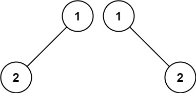

给你两棵二叉树的根节点 p 和 q ，编写一个函数来检验这两棵树是否相同。

如果两个树在结构上相同，并且节点具有相同的值，则认为它们是相同的。

---

示例 1：


输入：p = [1,2,3], q = [1,2,3]
输出：true

---
示例 2：


输入：p = [1,2], q = [1,null,2]
输出：false

---
示例 3：


输入：p = [1,2,1], q = [1,1,2]
输出：false
 
```
/**
 * Definition for a binary tree node.
 * struct TreeNode {
 *     int val;
 *     TreeNode *left;
 *     TreeNode *right;
 *     TreeNode() : val(0), left(nullptr), right(nullptr) {}
 *     TreeNode(int x) : val(x), left(nullptr), right(nullptr) {}
 *     TreeNode(int x, TreeNode *left, TreeNode *right) : val(x), left(left), right(right) {}
 * };
 */
class Solution {
public:
    bool isSameTree(TreeNode* p, TreeNode* q) {
        if (!p && !q) return true; // 两个树都没有根
        if (!p || !q || p->val != q->val) return false; // 两个树中有一个有根有一个无根或者两个都有根但是数值不一样
        return isSameTree(p->left, q->left) && isSameTree(p->right, q->right); // 比较左右子树是否相同
    }
};
```